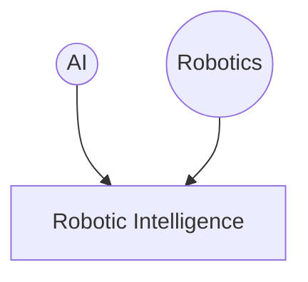

# Trends
- Classical Robotics:
	- Exact models
	- No sensing necessary
- Hybrids
		- Model-based at higher level
	- Reactive at lower levels
- Reactive robotics
	- No model
	- All relying on sensors

## Simplistic concept of robotic intelligence

>[!example] Motion planning
>Moving from **planinng in AI** to planning the **motion of a Robot**.
>The problem here is:
>- We have an initial orientation and position
>- We need to reach some other position (and potentially orientation)
>- Find the shorter/optimal path (depending on the needs)
>- Yo want to find a trajectory avoiding the obstacle
>
>You also need to define/know
>- Margins around objects
>- The robot is not a point, it has some volume/area. So the approach is making the assumption the robot IS a point and objects have margins
>
>You can then divide the space in regions like this:
>![[Pasted image 20241029154406.png]]
>From which you can obtain a node diagram
>
>If your robot is not the *ideal*, and it is not circular, you can also stack rotations, for each rotation, instead of assuming a circle, you set margin according to that rotation, so you will have a 3D matrix of margins (one for each rotation)
>

## On robotic arms

...with 2 deg. of movement, you are moving on a torus surface (two angles on a graph)

# About the presentation

