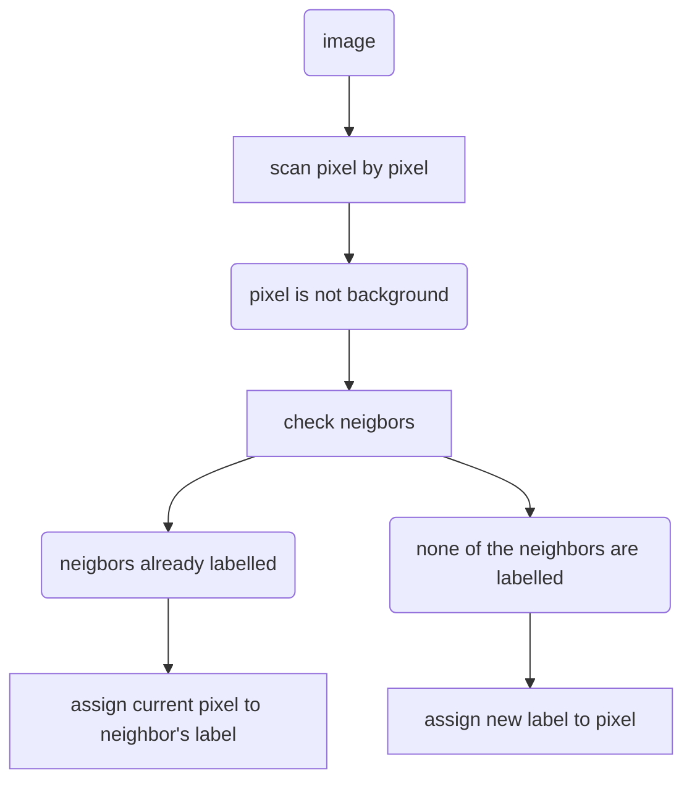

# 7.1 Segmentation
“*Segmentation of nontrivial images is one of the most difficult tasks in image processing. Segmentation accuracy determines the success or failure of computerized analysis procedures*”

- Segmentation: Divide an image into regions. 
- Region: Set of connected pixels that have a series of common features. 
- Features: 
	- Gray level 
	- Color 
	- Other (e.g. texture, motion, depth, ...)

## 7.1.1 Gray levels:

- Object detection and recognition: 
	- Separate objects from background using gray level features. 
	- Object recognition, e.g., from their shape.

## 7.1.2 Color:

- Object detection and recognition: 
	- Region recognition by their color.
	- Objects can be made by several regions.

## 7.1.3 Texture:

- Object detection and recognition: 
	- Non-uniform gray level regions.
	- Need more complex features.

## 7.1.4 Thresholding

- Transform a gray level image into a binary image. 
- We assume uniform gray level objects and background.
	![[Pasted image 20241014151919.png]]
- Different means and standard deviations for objects and background 
- How to choose a threshold?
	![[Pasted image 20241014152004.png]]
>[!abstract] Annotation
>If the contrast between the subject and the background is small, the differenciation between background and foreground is not that clear

# 7.2 Thresholding methods

## 7.2.1 OTSU

- Assume two Gaussian distributions
- Minimize the weighted sum of variances

![[Pasted image 20241014152227.png]]
For $t : (0-BitDepth)$ try every threshold until the inner variance on both subclasses defined by that threshold is minimized.

## 7.2.2 Kittler-Illingworth

Assume two Gaussian distributions; one for each the background and the foreground. The image will be understood as the sum of those Gaussians:

![[Pasted image 20241014152502.png]]
By means of a *Distribution Estimation Algorithm*, like *log-likelihood*, the parameters that define those Gaussians can be obtained (means and variances).

The threshold will be determined as the non-zero (not on the sides, where it is 0) minimum point of the sum of Gaussians.

>[!warning] Attention
>Don't look at the graphs above, image recycled from previous point
## 7.2.3 Recursive thresholding

When there are several objects/backgrounds 
- Apply a given thresholding method. 
- Analyze the obtained histogram. 
- Repeat the process until the histogram per regions approximately uniform

![[Pasted image 20241014153101.png]]
## 7.2.4 Region growing

**Concept**: Through some criteria (even manually), some points are set as *seeds*. Region growth consists in expanding the regions from the seed-points center and by means of some rules "*homogeneity criteria*".  

![[Pasted image 20241014153331.png]]

Results depend on:
- The amount of seed-points
- The quality of the seed-point selection
- The growth rules...

## 7.2.5 Region splitting

The opposite of region growing; top-down approach; hierarchical division by use of a *quad-tree*^1
Start from the entire image, then if it is not homogeneous, split into four sub-images, repeat recursively until the image is split into homogeneous regions

![[Pasted image 20241014153631.png]]

## 7.2.6 Split and merge

Back and forth algorithm; "floating search". Based on the combination of division and merging (as name implies):

- Start with the whole image.
- If the variance is too high, split: 
	- Break into quadrants. 
- Merge any adjacent regions that are similar enough.
- Repeat split and merge steps iteratively until no more splitting or merging occur.
- Problems: 
	- If not enough iterations region contours are not very precise.

Also, if division level is low, resulting image appears "pixeled" or low-res:

![[Pasted image 20241014154108.png]]

# 7.3 Alternative methods:

## 7.3.1 Clustering:

Commonly used in **non-supervised machine learning**.

1. Randomly choose K cluster centers. 
2. Calculate the probability that a sample belongs to a cluster (distance to the cluster center). 
3. Assign each sample to the most probable cluster (mínimum distance to cluster center). 
4. Recalculate clusters centers. 
5. Repeat from step 2 until no changes in samples cluster assignment or maximum of iterations.

![[Pasted image 20241014154513.png]]

>[!hint] Relation
>Establishing relation between *ROI* and *CLASS* 

![[Pasted image 20241014154632.png]]

Making each class not only represent a color, but also a region. After finding the color, remap to the region. According to which class is each pixel in, we can sort of "*threshold*" the image.

This is called **K-Means** alg. and it is simple yet effective (especially if the classes all well enough differentiated)

## 7.3.2 Watershed transform

**Watershed**: in geography, an area of high ground from which water flows down to a river. Mountain chain that separates two riverbeds. Analogously, an image gray levels can be treated as a topological surface.

This **transform** is usually applied to the **image gradient**, where flat areas are interpreted as objects and gradient ridges as object borders

The main issue with this transform is **oversegmentation**

![[Pasted image 20241014160447.png]]
![[Pasted image 20241014160457.png]]

## 7.3.3 Snakes:

Evolution of simple contours defined by user, to adapt to the shape inside or close to the borders of the defined shape. Analogous to a string being tightened around something.

![[Pasted image 20241014161434.png]]

## 7.3.4 Convolutional Neural Networks (CNN)

![[Pasted image 20241014162353.png]]

## 7.3.5 Connected components labeling:

- Assign a label (numerical value) to all pixels belonging to the same region, i.e., to all pixels connected among them.
- Connectivity: 4 or 8. 
- Algorithms: 
	- Recursive. 
	- Iterative. 
	- Classical. 
		- Based on an equivalence table.
		- Two image scans.

**CONNECTIVITY**

![[Pasted image 20241014165848.png]]
![[Pasted image 20241014165903.png]]
![[Pasted image 20241014165916.png]]
**LABELING**

