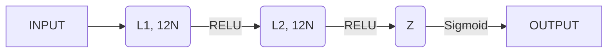

# 12.0 Fundamentals

- Training
	- *Overfitting* (non-generalizable)
	- *Underfitting* (non-sufficiently trained)
- Parameters / Hyper-parameters
- Sample set division (train/validation/test)
	- Train -> Parameters adjustment
		- NN-> Weight of each Neuron
	- Validation -> Asserting the correct generalization, while training the model (makes part of the training), used for making design choices (about the choosing a model, or about its hyper-parameters)
	- Test -> Asserting the accuracy/quality of a model (after training)
- Learning paradigms
	- Supervised/Non-supervised/Hybrid/Reinforcement
- Validation techniques
	- Leave-one-out
	- K-fold validation
- Hyper-parameters: define the model
	- How to chose a hyper-parameter: 
		- for instance "K" in K-neighbors, depends on the density of the data; if the density is high, K should be bigger, if the density is lower, K should be lower (accounting for more K, will return elements so far that they shouldn't be accounted for)
		- in ***NN***, we have $N_{hidden\_layers}$, $Size_{layer}$, $Size_{batch}$, $F_{activation}$
- Linear classification models
- ***NN*** training techniques
	- Back-Propagation: Calculate ***gradients***
- ***NN*** regularization techniques: ??

# 12.1 Deep learning

![[Pasted image 20241106154508.png]]

![[Pasted image 20241106154618.png]]

"*Learning from raw data, without context, in a way in which the model can make useful decision*"

Examples where deep learning exceeds (or simply make conclusions that a human can not)

- Image recognition in medicine; draw conclusions from radiografy, CAT...
- computer [gaming](https://es.wikipedia.org/wiki/AlphaGo_versus_Lee_Sedol)
- lipreading ([LipNet 95% - humanos 52%](https://arxiv.org/pdf/1611.01599.pdf))

# 12.2 Linear models

"*a fully connected neural network 𝑓 is a composition of nonlinear transformations of linear models (linear combinations of features)*"

![[Pasted image 20241106160224.png]]

![[Pasted image 20241106161004.png]]

## Linear transformation:
$$
z_n = \omega^Tx +b = \sum_{i=1}^{d}w_ix_i+b
$$
Where:
- $\omega$ = weight vector
- $x$ = input data vector
- $b$ = a bias; threshold
- $z$ = the function of linear combination in a neuron

In a simplified notation ("*compact notation*"), instead of having $b$as a separate value, we add a weight $w_0 = b$ with an input of 1:

![[Pasted image 20241106162006.png]]

## Activation function:
![[Pasted image 20241106161040.png]]
$$h = g(z) = g(w^Tx)$$

Where:
- $g$ nonlinear activation function
- $h$ nonlinear function output

>[!reminder] Investigate
>***"NORM"*** of a vector

## Types of activation functions:

### STEP:

![[Pasted image 20241106162141.png]]
![[Pasted image 20241106162231.png]]
**DRAWBACK**: Derivative is 0; cannot learn from it

### SIGMOID:

![[Pasted image 20241106162310.png]]

![[Pasted image 20241106163142.png]]
Function is derivable, continuous; also, its derivative is never 0 (it approximates but it is not) -> Function is sensitive to changes in input.

- Change in output between -1 and 1 is very useful
- Derivable
- Continuous

Notes:
- Usually used in intermediate layers, and output layer

Drawback:
- Saturation happens quickly (derivative = 0), which makes learning very hard

### RIGID SIGMOID:

![[Pasted image 20241106163336.png]]
Advantages: 
- Non Lineal
- Derivative (by segments)
- Computationally easy

# 12.3 NN Terms

Epoch: One period over which we iterate all samples; there are iterations smaller than an epoch (one batch iteration, for example)

Batch size influence: 
- Bigger batches give more stability
- Smaller batches (actually, a larger amount of batches) allow for more exploration

Metrics for validation or testing:
- How to decide metric?
	- Has to have a correlation (or at least coherence) with the loss function used for training
	- Sometimes, loss function, can be the (negative) metric itself; although in classifiers, we need a numerical value for evaluation, more than a fixed integer...

How to decide which epoch is the best?
- Validation accuracy
- Validation loss

# 12.4 Limitations of a linear model

![[Pasted image 20241106174026.png]]

**UNDER-FITTING** -> The model is incapable of modeling this data; cannot learn.

We now need, at least, one non lineal --> ***Fully Connected Multilayer Networks***

# 12.5 Fully connected multilayer networks

![[Pasted image 20241106174314.png]]
![[Pasted image 20241106174619.png]]

>[!reminder] Investigate 
>**RELU** versions



# 9.5 Back-propagation

## NN learning method

Learning goal: Progressive adjustment (iterative optimization) of weights that minimize the error/loss of the network on a representative set of training samples. Potentially, a network with sufficient learning capacity could achieve zero error on the training set; however, it is not usually a desirable goal (over-fitting risk).

![[Pasted image 20241113151658.png]]

We divide the sample set in batches (length_batch < length_sampleSet) and we feed the NN.
y' being the predicted value, and y being the actual label of the sample, we want to calculate the error(loss; $L$) of that batch
We update the weights of all neurons in the NN as many times as:
$$N_{batches} · N_{epochs} = N_{weight\space updates}$$
Having a large number of weight updates is useful for absorbing errors in weight updates. We can make errors in some iterations but they will be absorbed in the great scheme of learning.

Another variable is the learning rate ($\gamma$), which allows controlling the rate with which we change the weight of the neurons. A smaller learning rate makes the model take longer to train, and a larger one makes the learning curve more oscillatory and sensitive to errors.

We update the weights with a **negative gradient of the lost**

$$ w(t+1) = w(t) - \gamma \frac{dL}{dW}(w(t))$$

Code sample:
```vb
initialize network weights w(0) with small arbitrary values 
for epoch = 1...K, do
	for batch = 1...N/batch_size, do
		batch <– randomly choose batch_size instances 
		X, y <– preprocess(batch) 
		z <– network(X) (forward execution) 
		ℓ <– loss(z, y) 
		g <- gradients(ℓ, w) (backward execution) 
		w(t+1) <- w(t) – γ · g (weight optimization/fitting) 
	end for 
end for
```


>[!reminder] Chain rule
>![[Pasted image 20241113152803.png]]
>
>**Use**: Loss functions are composite functions and must be derived
>*Take this calculations with a grain of salt...they are not correct*
>$$\frac{DL}{D\omega_o}$$
>$$L = \sum_{j=0}^{M-1} \omega_j*O_j$$
>$$\omega_j = (y'_j - y_j)^2$$
>
>That is a composite function, inner being:
>$$x-k$$
>And outer being:
>$$x^2$$
>
>That way:
>$$\frac{DL}{D\omega_o} = \frac{dy'_j}{d\omega_0} · \frac{dL}{dy'_j}$$
>
>And that is only for one layer...extending to the second-the-last makes a need fro double dependencies, and it grows quadratically

## Gradient descent

Gradient descent is used because the gradient points to the direction of most growth of a function, and since we want to MINIMIZE it, we compute the inverse of the gradient:

![[Pasted image 20241113154050.png]]
At the point on this picture, the derivative is positive (function grows at that point) but since we want to fall in the local minimum, we wanna go backwards; -gradient

The closest to the minimum (where the gradient has a value of 0), the lower value the gradient takes, so the changes in weights are smaller the closer we get to the minimum, so the weight stabilizes.

Same thing in more directions.
![[Pasted image 20241113154058.png]]

The drawback for this method is that it is prone to falling in local minima.

Depending on the learning rate ($\gamma$):

![[Pasted image 20241113154500.png]]

Generally, the learning rate is not let as a constant. Since the learning curve tends to converging, the learning rate should also decrease with epochs. Few common methods.

- **Learning schedules**
- **Warm-up** $\gamma$ (for the first samples; some first epochs) which is lower than the expected one, gamma is increased with first epochs until the peak defined value is reached, then it is lowered progressively til the end of epochs  

## Solution scheme

![[Pasted image 20241113155950.png]]

![[Pasted image 20241113160008.png]]

1. initialize weights, choose learning coefficient, choose stop criterion 
2. create an arbitrary batch (X, y) --> (subset of instances, expected output). 
3. forward execution: walk X through the network and get output z. 
4. compute loss(y, z) 
5. backward execution (back-propagation) 
	- compute sensitivity coefficient $𝛿𝐿 = 𝑓(𝛿𝐿+1)$ from input to layer L 
	- compute gradients $\frac{𝜕𝐸}{𝜕𝑤𝑖𝑗^{𝐿−1}} = 𝑓(𝛿𝐿)$  (direction from layer L to Input)
7. weight optimization 
8. check stopping criteria; if it is fulfilled, then finish; otherwise, go to step 2

![[Pasted image 20241113160251.png]]

![[Pasted image 20241113160304.png]]

>[!example] Example with number image classification
>Having a set like this on a convolutional NN:
>![[Pasted image 20241113163243.png]]
>We will want to have a Y and Y' like vectors of length = classes, that way we will be able to calculate an error from the detected with the expected. Take a "2" image as an example (**ONE HOT ENCODING**; see below):
>
>Label (Y):
>[0,0,1,0,0,0,0,0,0,0]
>Prediction (Y')
>[0.0,0.2,0.9,0.4,0.6,0.1,0.65,0.2,0.5]
>Loss:
>[0.0,0.2,-0.1,0.4,0.6,0.1,0.65,0.2,0.5] 
>
>That way we can use this discrete system; if we had a single value for class, continuous and from 0-10, it would predict a number in that range. 
>
>How to calculate the amount of levels?
>
>|   |   |   |   |   |   |   |
|---|---|---|---|---|---|---|
|**layers**|**input**|**h1**|**h2**|**h3**|**output**|**TOTAL**|
|**units**|784|64|64|64|10|202|
|**weights**||50,176|4,096|4,096|640|59,008|
|**bias**||64|64|64|10|202|
|**TOTAL**||50,240|4,160|4,160|650|59,210|
>
> The weights of a layer (n) are calculated as:ç
> > $$N_{weights\space L \space total} = Weights_{entering} + Biases$$
> $$N_{weights\space L \space total} = Number_{neurons L-1} * Number_{neurons \space L} + Number_{Neurons \space l}$$
> 
> So for ***hidden layer 1***, we got 784 inputs on every one of our 64 neurons (each one having a weight) plus one bias for each one of our 64 neurons:
> 
> $$Weights = 784 · 64$$
> $$Biases = 64$$
> 
> $$N_{params} = Weights + Biases$$
> 
> #exam :LiArrowBigUpDash:  Calcular los pesos por capa en una NN (WTF Holy SHIT OMG) 

## Reviewing activation function
![[Pasted image 20241113173246.png]]
- **RELU**
	- For *negative values* the derivative is 0
	- For *positive values*, the derivative is 1 (the neutral multiplication parameter)
- **SOFTMAX**:
	- Good alternative to sigmoid. A sigmoid both predicts the positive probability and the negative, an alternative to ONE sigmoid would be TWO SOFTMAX, one for the positive, one for the negative, which complement eachother
	- Projects a vector of real data onto a probability distribution:
	  $$s: \Re ^k \rightarrow [0,1]^k, \sum_i s(z)_i = 1$$
	  Where:
	  $$s(z)_i = \frac{e^z_i}{\sum_{k=1}^k e^z_k}$$
	   ![[Pasted image 20241113173841.png]]
	   ![[Pasted image 20241113173909.png]]
	   The result is a function that tends to concentrate the probability in the most likely class to predict (see that the difference between the entry is no more than 2 yet the 4 has a much bigger weight)	   ![[Pasted image 20241113174028.png]]
	   And if we jump to 8...the effect is clear	   ![[Pasted image 20241113174153.png]]

## One-hot encoding:

![[Pasted image 20241113174324.png]]
![[Pasted image 20241113174332.png]]
With the help of the *soft-max*, the probabilities will be concentrated in a single vector position.

![[Pasted image 20241113174915.png]]![[Pasted image 20241113174941.png]]

**what if classes are imbalanced?** 
- many more loss terms from the majority class than from the rest 
- all the loss terms matter (wheigh) the same 
- the majority class examples dominate the loss function 
- the majority class examples dominate gradient propagation
- more model weight updates to favor the majority class 
- the model will be more confident in predicting the majority class
- little emphasis on minority classes 
- summary: biased classifier learning

**balanced cross entropy** to handle class inbalance

![[Pasted image 20241113175711.png]]

![[Pasted image 20241113175659.png]]

