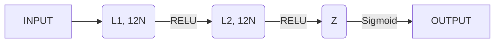

# 12.0 Fundamentals

- Training
	- *Overfitting* (non-generalizable)
	- *Underfitting* (non-sufficiently trained)
- Parameters / Hyper-parameters
- Sample set division (train/validation/test)
	- Train -> Parameters adjustment
		- NN-> Weight of each Neuron
	- Validation -> Asserting the correct generalization, while training the model (makes part of the training), used for making design choices (about the choosing a model, or about its hyper-parameters)
	- Test -> Asserting the accuracy/quality of a model (after training)
- Learning paradigms
	- Supervised/Non-supervised/Hybrid/Reinforcement
- Validation techniques
	- Leave-one-out
	- K-fold validation
- Hyper-parameters: define the model
	- How to chose a hyper-parameter: 
		- for instance "K" in K-neighbors, depends on the density of the data; if the density is high, K should be bigger, if the density is lower, K should be lower (accounting for more K, will return elements so far that they shouldn't be accounted for)
		- in ***NN***, we have $N_{hidden\_layers}$, $Size_{layer}$, $Size_{batch}$, $F_{activation}$
- Linear classification models
- ***NN*** training techniques
	- Back-Propagation: Calculate ***gradients***
- ***NN*** regularization techniques: ??

# 12.1 Deep learning

![[Pasted image 20241106154508.png]]

![[Pasted image 20241106154618.png]]

"*Learning from raw data, without context, in a way in which the model can make useful decision*"

Examples where deep learning exceeds (or simply make conclusions that a human can not)

- Image recognition in medicine; draw conclusions from radiografy, CAT...
- computer [gaming](https://es.wikipedia.org/wiki/AlphaGo_versus_Lee_Sedol)
- lipreading ([LipNet 95% - humanos 52%](https://arxiv.org/pdf/1611.01599.pdf))

# 12.2 Linear models

"*a fully connected neural network 𝑓 is a composition of nonlinear transformations of linear models (linear combinations of features)*"

![[Pasted image 20241106160224.png]]

![[Pasted image 20241106161004.png]]

## Linear transformation:
$$
z_n = \omega^Tx +b = \sum_{i=1}^{d}w_ix_i+b
$$
Where:
- $\omega$ = weight vector
- $x$ = input data vector
- $b$ = a bias; threshold
- $z$ = the function of linear combination in a neuron

In a simplified notation ("*compact notation*"), instead of having $b$as a separate value, we add a weight $w_0 = b$ with an input of 1:

![[Pasted image 20241106162006.png]]

## Activation function:
![[Pasted image 20241106161040.png]]
$$h = g(z) = g(w^Tx)$$

Where:
- $g$ nonlinear activation function
- $h$ nonlinear function output

>[!reminder] Investigate
>***"NORM"*** of a vector

## Types of activation functions:

### STEP:

![[Pasted image 20241106162141.png]]
![[Pasted image 20241106162231.png]]
**DRAWBACK**: Derivative is 0; cannot learn from it

### SIGMOID:

![[Pasted image 20241106162310.png]]

![[Pasted image 20241106163142.png]]
Function is derivable, continuous; also, its derivative is never 0 (it approximates but it is not) -> Function is sensitive to changes in input.

- Change in output between -1 and 1 is very useful
- Derivable
- Continuous

Notes:
- Usually used in intermediate layers, and output layer

Drawback:
- Saturation happens quickly (derivative = 0), which makes learning very hard

### RIGID SIGMOID:

![[Pasted image 20241106163336.png]]
Advantages: 
- Non Lineal
- Derivative (by segments)
- Computationally easy

# 12.3 NN Terms

Epoch: One period over which we iterate all samples; there are iterations smaller than an epoch (one batch iteration, for example)

Batch size influence: 
- Bigger batches give more stability
- Smaller batches (actually, a larger amount of batches) allow for more exploration

Metrics for validation or testing:
- How to decide metric?
	- Has to have a correlation (or at least coherence) with the loss function used for training
	- Sometimes, loss function, can be the (negative) metric itself; although in classifiers, we need a numerical value for evaluation, more than a fixed integer...

How to decide which epoch is the best?
- Validation accuracy
- Validation loss

# 12.4 Limitations of a linear model

![[Pasted image 20241106174026.png]]

**UNDER-FITTING** -> The model is incapable of modeling this data; cannot learn.

We now need, at least, one non lineal --> ***Fully Connected Multilayer Networks***

# 12.5 Fully connected multilayer networks

![[Pasted image 20241106174314.png]]
![[Pasted image 20241106174619.png]]

>[!reminder] Investigate 
>**RELU** versions

