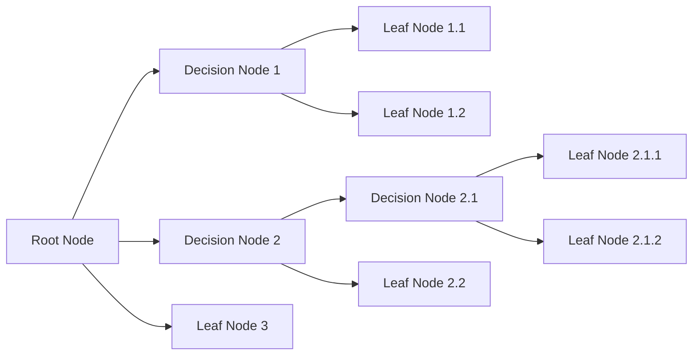

# 5.0 Notes

# 5.1 Intro
## 5.1.1 Objective

- Inference, learning, tree generation; obtaining the best possible splt, at leaf nodes, of the training samples, building smaller, more optimized tree
- Use/explotaition in predicting a class or even the value of a target variable (regression)

## 5.1.2 Strategy for building the decision tree
1. Progressive splitting of the set into smaller subsets
2. Recursive splitting of the set based on the value of atributes
3. Creating a labelled leaf that identifies a class
4. Pruning: branch with mixed subset of distinct classes is labelled with the majority class



# 5.2 Learning and classification of a decision tree

![[Pasted image 20240925162447.png]]

>[!example] Decisions taking
>![[Pasted image 20240925162601.png]]

Un arbol de decision puede ser expresado en forma de if-else, lo cual lo hace muy facil de interpretar:

```python
if x1 > w1:
	if x2 > w2:
		return classSquare
	return classCircle
return classCircle
```

# 5.3 Univariate trees

$f_m(x)$ of each internal node is defined in terms of a single dimension (attribute) $x_i$


| If $x_i$ is discrete, there will be a new branch for each option<br>![[Pasted image 20240925163052.png]] | if $x_i$ is continuous, the variable is getting subdivided in subregions<br>![[Pasted image 20240925163110.png]] |
| -------------------------------------------------------------------------------------------------------- | ---------------------------------------------------------------------------------------------------------------- |
Branches should be **organized** to be the **most discriminating**. *For instance, if one attribute separates the data into 80%-20%, it will be preferable to be asserted first, it discriminates the set better*. This is in order to

>[!example] Purity of a node
>![[Pasted image 20240925163449.png]]

## 5.3.1 Impurity measure for leaf nodes

***The bigger the number (either GINI or ENTROPY) the less pure a node is***

- $N_m$ is the number of instances reaching the node m
- $N_{i,m}$ is the number of instances reaching the node m that belong to the class $w_i$
- $P_{i,m}$ is the probability of class $w_i$ in node m

**Entropy** is calculated as:

$$
I_m =-\sum_{i=1}^{c}P_{i,m}log_2(P_{i,m})
$$
The scope is **minimizing the module of the entropy** (conceptually, the elements are more ordered)

>[!example] Related to previous example
>![[Pasted image 20240925163935.png]]
>![[Pasted image 20240925163945.png]]

**Gini index** is calculated as:

$$
G_m = 1-\sum_{i=1}^cP_{i,m}^2
$$

The objective is **minimizing the value of the Gini index**

>[!example] Related to previous example
>![[Pasted image 20240925164240.png]]


## 5.3.2 Measure for impurity of a split
![[Pasted image 20240925164530.png]]

The impurity of a split is calculated as:
$$
I_m^* = -\sum_{j=1}^{n}(\frac{N_{m,j}}{N_m}(\sum_{i=1}^{k}p_{m,j}^ilog_2p_{m,j}^i))
$$

## 5.3.3 Local optimization

## 5.3.4 General tree induction

General tree induction algorithm:
![[Pasted image 20241027184942.png]]

Where:
![[Pasted image 20241027185021.png]]

# 5.4 Pruning (*poda*)

To generate a “pure” tree trying to learn from: 
- outliers 
- small sample size (small number of instances) 
- overlapping

## 5.4.1 Pre-Pruning:
 
*"do not split nodes with few instances while growing the tree"*

1. let m be a node and Nm the number of samples (instances) 
2. stop splitting the training set 
	1. if m is pure (“natural end”) or 
	2. if $N_m < \theta$ (pruning) 
3. label m with the majority class among the Nm instances


## 5.4.2 Post-Pruning:

*after building the tree to its depth, remove unnecessary subtrees*

The idea is to generate 3 independent (and disjoint) sets for training, pruning, and test.

- **training**: generate the complete tree, with all its pure leaves, using the training set 
- **pruning** (it is part of the learning stage): 
	- replace each subtree by a leaf node with the label of the majority instances covered by that subtree 
	- prune the subtree if the “surrogate” leaf node does not worsen its performance with the pruning set 
- **evaluation**: obtain a performance measure of the final (pruned) tree by classifying the test set

## 5.4.3 Conclusions:

Experiments show that: 
- post-pruning produces more accurate trees (both classification and regression) than pre-pruning 
- pre-pruning is much faster than post-pruning

>[!success] Advantages
>- **Comprehensive**: it is good for interpreting data in a highly visual way 
>- **Simplicity**: it is one of the simplest algorithms since it has no complex formulas or data structure

>[!fail] Disadvantages
>- It is **computationally expensive**. At each node, the candidate split must be sorted before determining the best 
>- It is sometimes **unstable as small variations in data** might lead to the formation of a new tree
