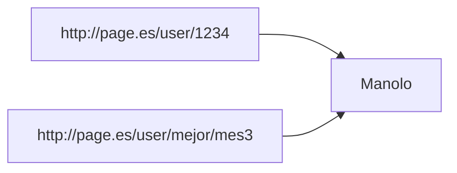
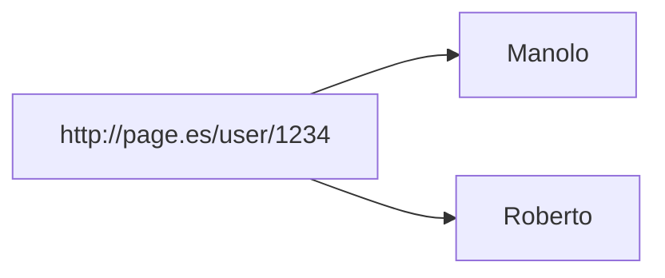

# 2.0. Notes
- [REST Cheatsheet](https://devhints.io/rest-api)
- my [[REST Cheatsheet]]
- [How caching works in REST](https://stellate.co/blog/deep-dive-into-caching-rest-apis) 
# 2.1. Cloud Native Applications definition

>[!quote] 
>*"Cloud native technologies empower organizations to build and run scalable applications in modern, dynamic environments such as public, private, and hybrid clouds. Containers, service meshes, microservices, immutable infrastructure, and declarative APIs exemplify this approach. These techniques enable loosely coupled systems that are resilient, manageable, and observable. Combined with robust automation, they allow engineers to make high-impact changes frequently and predictably with minimal toil."*

SaaS aplications based on **modular architecture** where **microservices** are managed in **containers**

# 2.2. Service Oriented Architecture (SOA)

Se debe modelar hacia la modularidad y que pueda ser integrado fácilmente con otros servicios.

Características:
- Independiente, cerrado, como una caja negra
- Autocontenido
- Puede estar compuesto por otros servicios

# 2.3. Microservices

*"Microservices refer to a style of application architecture where a collection of independent services communicate through lightweight APIs. 
A microservices architecture is a cloud-native approach to building software in a way that allows for each core function within an application to exist independently."*

Characteristics of microservices:
- Application development simplified. 
- Code changes will be small and of low complexity. 
- Scalability. 
- Microservices are fully tested and validated.

They isolate a specific function

# 2.4. RESTful services

 *"Representational State Transfer"*

Servicios para hacer un uso comprensivo de HTML, basado en 4 conceptos y 4 propiedades.

**Conceptos:**
- **Resources** (recursos): Toda pieza de información, cualquier elemento que, por su importancia, merece ser referenciado.
- **URI**: El mecanismo que hace a un recurso visible en la web
	- http://www.uji.es/agenda/entradas/ is clear.
	- http://www.uji.es/1/as2/ is cryptic.
	Pueden ser convergentes, porque no solo se tiene que interpretar como paginas, sino como peticiones a una REST API
**Puede pasar**:

**Pero NO**:

- **Representations**: Un archivo conteniendo la información del recurso, pero no el recurso en si (*PDF*, *XML*, *CSV*...)
- **Links**: 

**Propiedades**:
- **Addressable**: 
- **Stateless**: El estado se va comunicando entre el servidor y el cliente
- **Connection**: 
- **Uniform interface**: Comandos comunes
	- **GET**: 
		- Determinista (idempotente), siempre desencadena la misma acción
		- Seguro: No puede realizar cambios en el servidor
		- Cacheable: Se pueden hacer cosas de caching, especialmente en recursos pesados, para no tener que reventar la red a peticiones. 
			1. La primera vez se piden los datos
			2. El servidor los devuelve junto con un `ETAG` que identifica los datos de ese recurso
			3. La segunda vez, se piden los datos junto con un `ETAG`
			4. Si los datos no han cambiado (el server genera el mismo `ETAG`), no hace falta volver a comunicar los datos
	- **POST**: **Only** used in this subject to **create** resources (*can actually be used for both updating and creating but we will restrict for convenience*)
		- not idempotent, nos secure, nor cacheable
		- body of request includes all data
		- headers include lang prefs., or the format of the response
		- 
	- **PUT**: **Only** used in this subject to **update** resources (*can be used both for creating and updating but we will restrict a bit here for convenience*). Response can be `200 Ok` or `204 No Content`
		- `200 Ok` -> La respuesta puede contener una representación del recurso creado.
		- `204 No Content` -> Body vacío

>[!quote] 
> *Siempre que se modifique el estado del servidor, un método se considera "no seguro"*
> O sea que el único seguro es el GET

| **Method** | **Operation** |
| ---------- | ------------- |
| **POST**   | Create        |
| **GET**    | Retrieve      |
| **PUT**    | Update        |
| **DELETE** | Delete        |
# 2.5. Summary

1. Definir los recursos
2. Definir las representaciones para cada producto
3. Definir las URIs, con todos los filtros y parámetros
	- `www.../productos`
	- `www.../productos/{id}`
	- `www.../productos/categoría`
	- . . .
4. Decidir de manera consistente la jerarquía de las URI
	- `www.../clientes/{id}/facturas`
	- `www.../facturas/clientes/{id}`

>[!note] Ejercicio
>*"Let's assume that we are developing a (simple) contact list application."*
> - We want to: 
> 	- List all my contacts. **GET**
> 	- List the details of a contact. **GET** 
> 	- Add new contacts. **POST**
> 	- Update existing contacts. **PUT**
> 	- Remove an existing contact. **DELETE**
>
>1. **Recurso**: Contactos (**representacion** JSON)
>2. **URIs**:
>	`/contacts`
>	`/contacts/{id}`
>3. **Métodos**: (arriba en **negrita** al lado de cada funcion)

