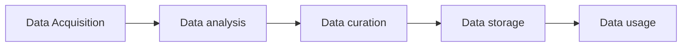
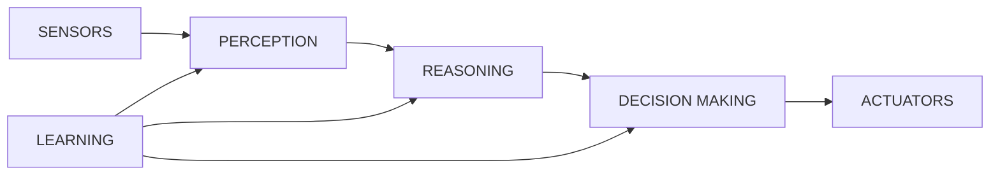

DATASETS: [kaggle](https://www.kaggle.com)

# 0. Notas

- DATATHON: [Datathon UniversityHack 2024 (cajamardatalab.com)](https://www.cajamardatalab.com/datathon-cajamar-universityhack-2024/centros/uji/)
- #pending Linkar la presentacion y el aula virtual en cuanto tenga la matricula hecha

# 1. Introduction:

- HORIZONTAL SCALABILITY: Distribución entre varios servidores

- VERTICAL SCALABILITY: Upgradear las specs del pc -> Mas potente

- VIRTUALIZACIÓN (cloud)

La complejidad del big data radica en que no somos capaces de ver todo el conjunto de los datos. Solo se suele tener una visión concreta, restringida de los datos, por lo cual se llega a conclusiones erróneas.

Es necesaria:

- Una visión cuanto más global mejor. E.g.: Modelos generales de lenguaje, han necesitado una cantidad de datos inmensa para llegar al nivel.

En esta asignatura se pondrá la materia en el contexto de una empresa, con sus necesidades generales y orientándolo por esas necesidades. BALANCE SCORED -> Maoa de dependencias en función de objetivos

**DATA-DRIVEN DECISION MAKING ->** Una manera de tomar decisiones y organizarse en función de objetivos y de métodos de análisis de datos.

**DATA VALUE VHAINS ->** Cadenas de valor, métodos para organizar los datos correctamente para el tema de sumar valor a una cadena

## 1.1 **DECISION MAKING**:

### Swot analysis
Tratamiento tradicional, manual, a partir de documentos.

>*No se tratara demasiado porque a nivel de big data poca cosa*

### AI-Powered intelligent system
1. **SENSORES**: Percepción
2. sensores -> **RAZONAMIENTO**: Procesado
3. razonamiento -> **DECISIONES**: Como controlar las actuaciones
4. decisiones -> **ACTUADORES**
5. **APRENDIZAJE**: Afecta a los tres campos anteriores de diferente manera

### What is AI?
Redes neuronales + Big Data -> Machine Learning
- Para tener big data, se necesita mucha capacidad de procesado, rapido -> CPU y se puede distribuir
- Para entrenar redes neuronales, se necesita capacidad de procesado en paralelo, grandes masas -> GPU y se debe concentrar

# 2. Business *intelling*

## 2.1 Enriched Data Value chains

# 3. Data science

Diferencia entre un científico de datos y un analista, es el concepto de la vision global, un científico sabe mucho de su campo, el analista sabe coger datos, manejarlos, y representarlas.

Un scientist plantea preguntas abstractas, hipótesis, y quiere resolverlas mediante los datos.

**SABER BUSCAR LOS DATOS**: Parte complicada, se necesita un experto, un data scientist

Un data scientist cubre:
- Business *intelling*
- Machine learning
- Ai
- Statistics (lo básico ya va bien)
- Big Data

**TRANSFORMACION DE LOS DATOS** en el contexto de la cadena de valor

1. Al manos **poner una referencia** a los datos
2. Voltear los ejes, cambiar los conceptos y hacer lo necesario para **ordenar los datos de una manera atractiva**
3. **Storytelling**, acompañar con ilustraciones y otros componentes visuales para que se entienda de manera adecuada

#review *Mirarse el grafico de la pagina 30 de las diapositivas. No la entiendo demasiado bien*

