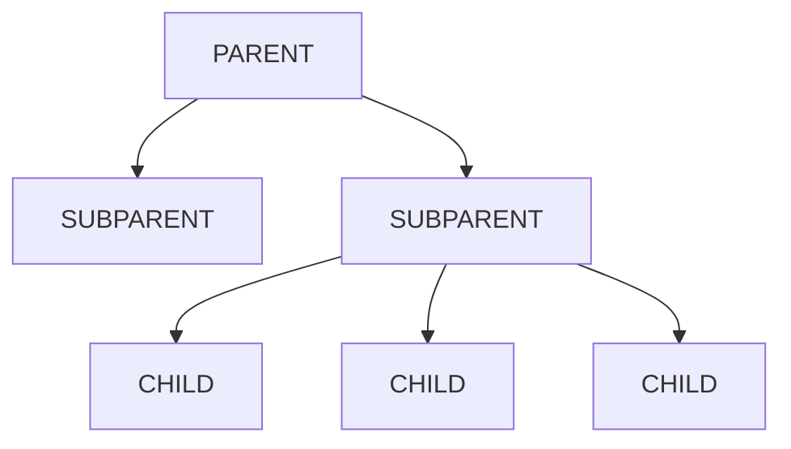

# 4.0 Notes
- [PowerBi]
- [Tableau]

# 4.1 Balanced scores
![[Pasted image 20240923182720.png]]![[Pasted image 20240923182730.png]]
# 5.2 Dashboards
Tabla de hechos (facts)
Construyes Dashboard

## 5.2.1 Facts
It is interesting for an analyst to have observations. Facts are derivations of one or more (usually more) data, joined and processed. Each fact is usually centered around a firm entity (sales, hr...)
The difficult part here is obtaining the facts; transforming the original data into a facts table.
Facts are defined as:
- A series of dimensions (name of variables, associations...; like names of towns, clients, types...)
- A series of measurements (numeric values)

>[!example]
>![[Pasted image 20240923184407.png]]
>`ZipCode -> City -> Province` are levels, they permit grouping. The fact that they need to be "functional dependencies", which means that "always that one is X, the other one is Y", pero solo en una dirección creciente, ahí es donde reside el poder agrupador.
>En la parte de abajo hay un ejemplo de un caso extraño de jerarquia, dependencia funcional, que no se puede definir, una fecha puede pertenecer a una semana, pero no necesariamente una semana tiene que pertenecer a un solo mes, ni siquiera a un solo año
>En ese ejemplo, city hace de agregador de zip y a su vez province hace de agregador de city y zip
>Alternativamente, week hace de agregador de date, pero month no puede hacer de agregador de month, year tampoco, pero month sí de date, y a su vez year sí de month.
>Habrá siempre una función de agregación de conceptos:
>- Agregar sumando
>- Multiplicando
>- Calculando el maximo/minimo
>- etc.
>Se puede organizar, de esta forma, en tablas
>![[Pasted image 20240923185226.png]]
>*Date cuenta de que no se han incluido explicitamente las agregaciones de las fechas, pues es muy sencillo en una DB sacar esas agregaciones*


## 5.2.2 CUBES

Tables converted to a multidimensional array, dynamically calculated, not a fix array

- It has a series of dimensions
	- Orthogonal
	- Associated different levels with an aggregation method
- Contains observed masures
- It works simmilar to a dictionary

### 5.2.2.1 Measures

A measure is a numerical dunction; the measure value of a cell is computed by aggregating the cells contained in it

Propiedades que deben cumplir las funciones de medida:
- **Distributiva**: Tenemos que poder agregar las celdas directamente
	- `count()`
	- `sum()`
	- `min()`
	- `max()`
	- ***`mean()`*** **NO PUEDE SERLO**, porque una media de medias no es lo mismo que la media global, no es distributiva
- **Algebraica**: avg(), standard_deviation()
- **NO Holistica**: Medidas que no pueden ser aggregadas de resultados parciales (mean y mode por ejemplo, como ya hemos dicho antes)



>[!example] Ejemplo
>Calcular la desviación estandar en cualquier valor de una jerarquia de agrupaciones. Se debe conseguir una operacion distributiva, para no tener que calcular un valor para cualquier tipo de combinacion, para que no haya una complejidad de calculo inmensa.
>
>Para eso, debemos encontrar una formula Algebraica o por lo menos Distributiva
>
>$$SD = \sqrt{\frac{\sum(X-\hat{x})^2}{n-1}} = \sqrt{E(x^2) - (E(x))^2} = \sqrt{av(x^2) - (av(x))^2}$$
>Necesitamos, por lo tanto: `sum()`, `count()`, `pow()`
>- Sum y Count para hacer medias
>- Pow para elevar y `sqrt` 
>
>**Formula resultante**: `pow((sum(x^2)/count() + (sum(x)/count())^2),0.5)`

### 5.2.2.2 OnLine Analytical Processing (OLAP / MDX)

Somehow like SQL, consists in constructing a spreadsheet

**Basic OLAP operations on cubes**
- `ROLL UP(Cube, Dim.)` → Reduce details 
- `DRILL DOWN(Cube, Dim.)`
- `ROLL ACROSS(Cube, Dim.) `
- `DRILL ACROSS(Cube, Dim.) `
- `SLICE(Cube, Dim., Level) `
- `DICE(Cube, D1, L1, D2, L2, …) `
- `PIVOT(Cube, Rows, Columns)`

**MDX**:
```SQL
SELECT
{ [Measures].[total_sales] } ON COLUMNS
{ [Time].[Q1], [Time].[Q2] } ON ROWS
FROM Sales
WHERE ([Item].[PCs])
```

**Alternative in Pandas**
```python
import pandas
pandas.pivot_table(data, values= [store_sales], 
				   index= [store_state], columns= [store_type], 
				   aggfunc='sum', fill_value=None, 
				   margins=False, dropna=True, margins_name='All',
				    observed=False, sort=True)
```

# 5.3 Activities
